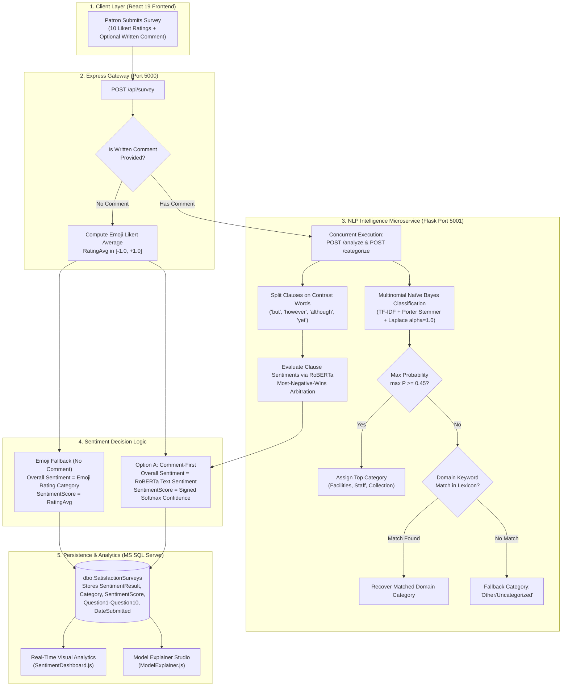

# Library Management System with Patron Satisfaction Survey
### Powered by Dual-Engine NLP (CardiffNLP RoBERTa BERT Sentiment Analysis & Multinomial Naïve Bayes Category Classification) + Explainable AI (XAI) Computation Studio

**Central Philippine University — College of Computer Studies**  
**Bachelor of Science in Computer Science**  
**Capstone Thesis Project — Henry Luce III Library (HLL)**

---

## 📌 Executive Overview

The **Henry Luce III Library Management System (HLL System)** is an enterprise-grade, full-stack academic library information and feedback intelligence platform developed for Central Philippine University. 

The platform unites essential day-to-day library operations — patron sign-in access monitoring, student demographic tracking, 4-slot book card and packet technical encoding, unified catalog search, multi-location office supplies inventory, library computer hardware asset tracking, and transactional audit trails — with an advanced **Dual-Engine Natural Language Processing (NLP) & Explainable AI (XAI) Pipeline**. 

Through this dual-engine pipeline, patron satisfaction surveys are continuously analyzed: sentiment polarity is captured via a CardiffNLP RoBERTa deep transformer model, thematic feedback is categorized into operational library departments via Multinomial Naïve Bayes with Laplace smoothing, and all scoring mechanics are rendered fully transparent through an interactive **AI Model Explainer & Mathematical Computation Studio**.

---

## 🚀 Recent Defense Updates & Post-Defense Refinements

Following the final defense proceedings and panelist evaluation, the system was significantly upgraded to provide absolute mathematical transparency, enhanced administrative analytics, modular architecture, and resilient inventory workflows:

### 1. AI Model Explainer & Mathematical Computation Studio (`/model-explainer` & `/score-computation`)
* **Panelist Recommendation Addressed**: Defense panelists recommended eliminating the "black-box" perception of hybrid sentiment scores by exposing the underlying mathematical computations and classification logic directly to evaluators and administrators.
* **4-Quadrant Analytical Architecture**:
  1. **RoBERTa Sentiment Decomposition**: Visualizes contrastive clause segmentation (`split_clauses`), individual clause sentiment scores, and the **Most-Negative-Wins** arbitration strategy.
  2. **Multinomial Naïve Bayes Probabilistic Inspector**: Details Porter stemming, TF-IDF feature vector extraction, token-level TF-IDF weights, prior probabilities, class posteriors ($P(\text{Category} \mid \text{Text})$), and confidence threshold gating ($\tau = 0.45$).
  3. **Cisco-Style Likert Simulation**: Models the 10 standard HLL service dimensions on a 5-point scale (Very Satisfied $+1.0$ down to Very Dissatisfied $-1.0$, with N/A exclusion) and calculates the response mean ($R_{\text{avg}}$).
  4. **Hybrid Formula Arithmetic Substitution**: Renders step-by-step arithmetic substitution for the composite score:
     $$\text{Final Score} = (R_{\text{avg}} \times 0.50) + (\text{BERT Score} \times 0.50)$$
     *(or falls back to $R_{\text{avg}}$ when no written comment is provided)*.
* **Live SQL Server Inspection**: Evaluators can select real survey submissions directly from `dbo.SatisfactionSurveys` to inspect their exact real-time computational breakdown.
* **Quick Defense Presets**: Includes 5 pre-loaded boundary test cases (Facilities HVAC, Staff Commendation, Collection Accession Mismatch, Compound Contrast Pivot, and Off-Topic Noise).
* **Interactive Dynamic Thresholding**: Sliders allowing real-time tuning of the fallback confidence threshold $\tau \in [0.10, 0.90]$.
* **Dedicated Backend Gateway**: Integrated `POST /api/debug/explain-scores` proxy in Express (`backend/index.js`) routing to Flask microservice (`sentiment_service.py`).

### 2. Executive Analytics Dashboard Overhaul (`SentimentDashboard.js`, `LoginDashboard.js`, `themeTokens.js`)
* **Unified Executive Design Tokens (`THEME`)**: Re-architected all dashboard interfaces around a cohesive executive palette: Deep Executive Navy (`#16324f`), Warm Golden-Orange (`#f69d1b`), Forest Green (`#107c41`), Slate Grey (`#64748b`), and Soft Cool-Grey Surface (`#eef1f6`).
* **Modularized Sentiment Visualizations (`SentimentCharts.js`)**: Decomposed monolithic chart rendering into dedicated modular sub-components: `SentimentDonutChart`, `CategoryBarChart`, `SentimentTrendChart`, `WordCloudChart`, `ActionableFeedbackCard`, and `ServiceRecommendationsCard`.
* **Animated Multi-Color Word Cloud**: Top 60 keywords rendered via `react-wordcloud` with dynamic scaling, smooth hover micro-animations, and domain-tailored stopword scrubbing.
* **Softmax Confidence-Ranked Actionable Feedback**: Top 5 positive and negative feedback cards ranked directly by RoBERTa Softmax probability with category diversity guards ($\le 2$ comments per domain).
* **Login Dashboard Foot Traffic Analytics**: Features real-time KPI cards (**Total Visits**, **Top College**, **Peak Section**, **Active Departments**), Bar and Pie charts, a dedicated **Guest Visualizer**, and modal authentication protection (`admin`/`admin`).
* **77-Course to 18-Department Normalization**: Standardizes all 77 CPU degree program codes into 18 parent college units via [`src/constants/collegeMap.js`](file:///c:/Users/LENOVO/OneDrive/Documents/Library%20Management%20System/hllsystem%20-%20Oct10-2025/src/constants/collegeMap.js).
* **Timezone Harmonization (`Asia/Manila`, UTC+8)**: Synchronized SQL Server date boundary parsing in `backend/index.js` and date picker logic (`YYYY-MM-DD 00:00:00` to `23:59:59.997`) to eliminate UTC offset truncation.

### 3. Modernized Property & Inventory Management (Nath's Refactor)
* **Centralized API Client Layer**: Replaced ad-hoc fetch calls with dedicated modular clients in [`src/api/equipmentApi.js`](file:///c:/Users/LENOVO/OneDrive/Documents/Library%20Management%20System/hllsystem%20-%20Oct10-2025/src/api/equipmentApi.js) and [`src/api/suppliesApi.js`](file:///c:/Users/LENOVO/OneDrive/Documents/Library%20Management%20System/hllsystem%20-%20Oct10-2025/src/api/suppliesApi.js).
* **Dual Asset Views**: Added grouped view (`/api/equipment/grouped`) and flattened inventory view (`/api/equipment`) for library computer hardware and equipment.
* **Stock-to-Location Transfers**: Seamless inter-section transfers (`/transfer`) with quantity verification and automatic status recalculations (`In Stock` vs `Out of Stock`).
* **Supply Disbursement Endpoint**: Added `POST /api/supplies/disburse` for logging consumable supply usage across library staff and departments.
* **Audit Transaction Trails**: Comprehensive historical audit logs in `AssetTransactions` and `SupplyTransactions` tracking action types (`Added`, `Updated`, `Deleted`, `Added Stock`, `LOCATION_TRANSFER`, `Sent Asset`).

### 4. Option A (Comment-First) Scoring & Dual-Engine NLP Hardening
* **Comment-First Scoring Architecture**: When an open-ended comment is provided, overall sentiment is derived **100% from RoBERTa BERT text analysis**, ensuring patron complaints are never diluted or masked by high emoji ratings.
* **Clause-Aware Dynamic Binding (`get_clause_category`)**: Splits compound feedback across contrastive conjunctions (`but`, `however`, `although`, `though`) and binds the overall category to the **winning negative complaint clause**.
* **Laplace Additive Smoothing ($\alpha = 1.0$)**: Eliminates zero-frequency probability collapse ($N_{ki}=0 \implies P=0 \implies \ln(0)=-\infty$) for unseen patron vocabulary or typos (`restrrom`, `drity`).
* **Dataset Scaling & Recalibration**: Model trained on **13,800+ samples** with 6% simulated annotator ambiguity (`apply_annotator_ambiguity`) and ~10% context-free noise, establishing an honest, defensible **93.0%–95.6% accuracy benchmark**.

---

## 🏗️ System Architecture & Workflow

The platform follows a three-tier decoupled microservice architecture:

```
                                  ┌──────────────────────────────────────────────────────────┐
                                  │               React 19 Frontend Client                   │
                                  │           (Material-UI v7, Recharts, DataGrid)           │
                                  │                        Port 3000                         │
                                  └────────────────────────────┬─────────────────────────────┘
                                                               │
                                                       HTTP / REST APIs
                                                               ▼
                                  ┌──────────────────────────────────────────────────────────┐
                                  │            Node.js / Express Backend Gateway             │
                                  │                    (backend/index.js)                    │
                                  │                        Port 5000                         │
                                  └──────────────┬───────────────────────────┬───────────────┘
                                                 │                           │
                   Promise.all / Diagnostic Proxy│                           │ msnodesqlv8
                     /analyze, /categorize,      │                           │ ODBC Driver 18
                     /api/debug/explain-scores   │                           │
                                                 ▼                           ▼
            ┌───────────────────────────────────────────────┐   ┌───────────────────────────────────┐
            │         Python Flask NLP Microservice         │   │   Microsoft SQL Server Express    │
            │           (backend/sentiment_service.py)      │   │          Database: hllSystem      │
            │                     Port 5001                 │   ├───────────────────────────────────┤
            ├───────────────────────────────────────────────┤   │ • dbo.SatisfactionSurveys         │
            │ 1. RoBERTa BERT Sentiment Transformer         │   │ • dbo.LibLogins                   │
            │    (cardiffnlp/twitter-roberta-base-sentiment)│   │ • dbo.studInfo                    │
            │ 2. Multinomial Naïve Bayes Classifier         │   │ • dbo.CardAndPacket               │
            │    (category_model.pkl, alpha = 1.0)          │   │ • dbo.OfficeSupplies              │
            │ 3. Contrast Clause Splitter & Negative Wins   │   │ • dbo.LibraryEquipment            │
            │ 4. Laplace Additive Smoothing Visualizer      │   │ • dbo.AssetTransactions           │
            │ 5. Diagnostic Score Explainer Engine          │   │ • dbo.SupplyTransactions          │
            └───────────────────────────────────────────────┘   │ • dbo.Brands                      │
                                                                └───────────────────────────────────┘
```

### End-to-End Survey Submission Flow



---

## 🗺️ Application Features & Route Mapping

The frontend client comprises **19 functional pages**, modular components, and centralized constant libraries:

| Route Path | Page Component | Module / Role | Functional Description |
|---|---|---|---|
| `/` | [`Home.js`](file:///c:/Users/LENOVO/OneDrive/Documents/Library%20Management%20System/hllsystem%20-%20Oct10-2025/src/pages/Home.js) | Public Landing | Main entry portal and directory navigation hub. |
| `/login` | [`Login.js`](file:///c:/Users/LENOVO/OneDrive/Documents/Library%20Management%20System/hllsystem%20-%20Oct10-2025/src/pages/Login.js) | Patron Sign-In | Time-In / Time-Out access recording with real-time student ID lookup and photo rendering. |
| `/logindata` | [`LoginData.js`](file:///c:/Users/LENOVO/OneDrive/Documents/Library%20Management%20System/hllsystem%20-%20Oct10-2025/src/pages/LoginData.js) | Access Logs | Historical access monitoring table with batch deletion, date filtering, and search. |
| `/login-dashboard` | [`LoginDashboard.js`](file:///c:/Users/LENOVO/OneDrive/Documents/Library%20Management%20System/hllsystem%20-%20Oct10-2025/src/pages/LoginDashboard.js) | Admin Traffic Analytics | Executive foot traffic dashboard with 77-course normalization, guest visualizer, and Excel export. |
| `/satisfaction-survey` | [`SatisfactionSurvey.js`](file:///c:/Users/LENOVO/OneDrive/Documents/Library%20Management%20System/hllsystem%20-%20Oct10-2025/src/pages/SatisfactionSurvey.js) | Feedback Collection | 10-question Likert survey form with simplified faculty flows and open-ended commentary. |
| `/surveys` | [`SatisfactionSurveyData.js`](file:///c:/Users/LENOVO/OneDrive/Documents/Library%20Management%20System/hllsystem%20-%20Oct10-2025/src/pages/SatisfactionSurveyData.js) | Survey Records | Data grid displaying all historical survey responses, sentiment results, and college pills. |
| `/sentiment-dashboard` | [`SentimentDashboard.js`](file:///c:/Users/LENOVO/OneDrive/Documents/Library%20Management%20System/hllsystem%20-%20Oct10-2025/src/pages/SentimentDashboard.js) | Executive NLP Dashboard | Visual analytics for sentiment distribution, category shares, word cloud, and RoBERTa confidence highlights. |
| `/model-explainer` | [`ModelExplainer.js`](file:///c:/Users/LENOVO/OneDrive/Documents/Library%20Management%20System/hllsystem%20-%20Oct10-2025/src/pages/ModelExplainer.js) | Explainable AI (XAI) Studio | **New Post-Defense Studio**: Interactive mathematical explainer for RoBERTa, Naïve Bayes, and hybrid scoring. |
| `/score-computation` | [`ModelExplainer.js`](file:///c:/Users/LENOVO/OneDrive/Documents/Library%20Management%20System/hllsystem%20-%20Oct10-2025/src/pages/ModelExplainer.js) | Diagnostic Explainer Alias | Alias route for quick access during thesis evaluation and defense demonstrations. |
| `/card-and-packet` | [`CardAndPacket.js`](file:///c:/Users/LENOVO/OneDrive/Documents/Library%20Management%20System/hllsystem%20-%20Oct10-2025/src/pages/CardAndPacket.js) | Technical Services | Encodes up to 4 books per physical card packet with duplicate accession number validation. |
| `/book-catalogue` | [`BookCatalogue.js`](file:///c:/Users/LENOVO/OneDrive/Documents/Library%20Management%20System/hllsystem%20-%20Oct10-2025/src/pages/BookCatalogue.js) | Unified Catalog | Aggregated, searchable table of all cataloged book records with Excel export. |
| `/supplies` | [`Supplies.js`](file:///c:/Users/LENOVO/OneDrive/Documents/Library%20Management%20System/hllsystem%20-%20Oct10-2025/src/pages/Supplies.js) | Supplies Inventory | View-only catalog for consumable office supplies with low-stock badges. |
| `/equipment` | [`Equipment.js`](file:///c:/Users/LENOVO/OneDrive/Documents/Library%20Management%20System/hllsystem%20-%20Oct10-2025/src/pages/Equipment.js) | Equipment Inventory | View-only catalog for library hardware assets and equipment with grouped/flat toggle. |
| `/supplies-encoding` | [`SuppliesEncode.js`](file:///c:/Users/LENOVO/OneDrive/Documents/Library%20Management%20System/hllsystem%20-%20Oct10-2025/src/pages/SuppliesEncode.js) | Supplies Management | Encoding panel for office supplies: create, edit, delete, restock, and disburse. |
| `/equipment-encoding` | [`EquipmentEncode.js`](file:///c:/Users/LENOVO/OneDrive/Documents/Library%20Management%20System/hllsystem%20-%20Oct10-2025/src/pages/EquipmentEncode.js) | Equipment Management | Encoding panel for library equipment: serial numbers, brand creation, and restocking. |
| `/send-supply` | [`SendSupply.js`](file:///c:/Users/LENOVO/OneDrive/Documents/Library%20Management%20System/hllsystem%20-%20Oct10-2025/src/pages/SendSupply.js) | Supply Transfer | Section transfer form for allocating supplies to specific library rooms. |
| `/send-asset` | [`Sendasset.js`](file:///c:/Users/LENOVO/OneDrive/Documents/Library%20Management%20System/hllsystem%20-%20Oct10-2025/src/pages/Sendasset.js) | Asset Transfer | Section transfer form for moving equipment assets to destination sections. |
| `/supply-transactions`| [`SupplyTransactionHistory.js`](file:///c:/Users/LENOVO/OneDrive/Documents/Library%20Management%20System/hllsystem%20-%20Oct10-2025/src/pages/SupplyTransactionHistory.js) | Supply Audit Trail | Audit history log tracking all additions, restocks, disbursements, and transfers. |
| `/transactions` | [`Transactionhistory.js`](file:///c:/Users/LENOVO/OneDrive/Documents/Library%20Management%20System/hllsystem%20-%20Oct10-2025/src/pages/Transactionhistory.js) | Equipment Audit Trail| Audit history log tracking all asset additions, edits, and section transfers. |

### Component & Utility Architecture

```
hllsystem - Oct10-2025/src/
├── api/                           # Centralized Axios API client layer
│   ├── equipmentApi.js            # Equipment assets, brands, transfers, summary endpoints
│   └── suppliesApi.js             # Supplies inventory, disbursements, transfers endpoints
├── Components/                    # Reusable visual components
│   ├── Header.js                  # Global navigation bar with Model Explainer link
│   ├── TopBar.js                  # Sub-header bar with breadcrumb navigation
│   ├── PageHeader.js              # Standardized page title component
│   ├── ScrollToTopButton.js       # Floating scroll button
│   ├── SearchBox.js               # Debounced search bar input
│   └── SentimentCharts.js         # Modular charts (Donut, WordCloud, Bar, Feedback Cards)
└── constants/                     # Single source of truth for styles and dictionaries
    ├── collegeMap.js              # 77 degree program to 18 parent college normalization
    ├── equipmentConstants.js      # Status codes, default locations, specifications
    ├── sentimentConstants.js      # Controlled lexicon, stopwords, rating scores, college tags
    ├── sentimentUtils.js          # NSS formula, date math, category frequency aggregators
    └── themeTokens.js             # Executive color palette, typography, sx style presets
```

---

## 🔬 Data & Analytics Pipeline (Dual-Engine NLP & Machine Learning)

### 1. Dual-Engine Scoring Logic (Option A: Comment-First Sentiment)

The system enforces **Option A (Comment-First Sentiment)** to ensure patron written complaints are never masked by polite emoji ratings:

$$\text{Sentiment Score} = \begin{cases} 
\text{Signed RoBERTa Softmax Confidence } (\pm \text{Score}) & \text{if written comment is submitted} \\ 
R_{\text{avg}} \text{ (10-Question Likert Rating Average)} & \text{if comment field is empty} 
\end{cases}$$

* **Written Comments**: Processed through `cardiffnlp/twitter-roberta-base-sentiment-latest`. If BERT classifies the comment as `Negative` with $0.94$ confidence, `SentimentResult = 'Negative'` and `SentimentScore = -0.94`.
* **Blank Comments**: Falls back to the arithmetic average of the 10 Likert questions ($R_{\text{avg}} \in [-1.0, +1.0]$).
* **Threshold Classification**:
  * $\text{Score} > +0.15 \implies \textbf{Positive}$
  * $\text{Score} < -0.15 \implies \textbf{Negative}$
  * $-0.15 \le \text{Score} \le +0.15 \implies \textbf{Neutral}$

### 2. CardiffNLP RoBERTa Sentiment Engine (`POST /analyze`)
* **Underlying Model**: Deep transformer architecture (`cardiffnlp/twitter-roberta-base-sentiment-latest`) with 125 million parameters fine-tuned on nuanced sentiment and negation.
* **Conjunction Clause Splitting (`split_clauses`)**: Compound comments are segmented on contrastive conjunctions (`although`, `though`, `however`, `but`, `while`, `except`, `yet`).
* **Most-Negative-Wins Clause Aggregation**: If any clause is evaluated as `Negative`, the overall comment sentiment is classified as `Negative`. Actionable operational complaints take precedence over introductory politeness.

### 3. Multinomial Naïve Bayes Category Classification (`POST /categorize`)
* **Pipeline Architecture**:
  $$\text{Raw Feedback} \xrightarrow{\text{PorterStemmer}} \text{Stemmed Text} \xrightarrow{\text{TF-IDF Vectorizer}} \vec{x} \xrightarrow{\text{MultinomialNB}(\alpha=1.0)} \hat{C} \in \mathcal{C}$$
* **Classes**: $\mathcal{C} = \{\text{Facilities}, \text{Staff}, \text{Collection}, \text{Other/Uncategorized}\}$
* **Laplace (Additive) Smoothing ($\alpha = 1.0$)**:
  Eliminates zero-probability collapse when evaluating patron typos or unseen tokens:
  $$P(w_i \mid C_k) = \frac{N_{ki} + \alpha}{N_k + \alpha |V|}$$
  * Proof of normalization: $\sum_{i=1}^{|V|} P(w_i \mid C_k) = \frac{N_k + \alpha |V|}{N_k + \alpha |V|} = 1.0$.
  * Prevents $\ln(0) = -\infty$ joint likelihood failure on typos like `"restrrom"` or `"drity"`.
* **Confidence Threshold Fallback ($\tau = 0.45$)**:
  $$\text{Final Category} = \begin{cases} 
  \arg\max_{k} P(C_k \mid d) & \text{if } \max P(C_k \mid d) \ge 0.45 \\ 
  \text{Domain Lexicon Match} & \text{if } \max P < 0.45 \text{ and keyword exists} \\ 
  \text{"Other/Uncategorized"} & \text{otherwise} 
  \end{cases}$$
* **Winning Negative Clause Binding**: The assigned category is dynamically bound to the specific clause that generated the negative sentiment.

### 4. Data Cleaning & Normalization Pipeline (`backend/ml/clean_dataset.py`)

```
Raw Training Data (XLSX / CSV)
      │
      ▼
[1. Unicode Normalization] ─────> clean-text, transliterate mojibake, strip URLs/emails
      │
      ▼
[2. Repetition Collapse] ───────> Collapse 3+ character runs to 2 (e.g., "soooo" -> "soo")
      │
      ▼
[3. Non-Informative Filter] ────> Drop static tokens ("n/a", "none", "ok", "thanks")
      │
      ▼
[4. Length & Gibberish Guard] ──> Reject len < 3, 20+ char mashing, 5+ consecutive consonants
      │
      ▼
[5. Local Dialect Whitelist] ───> Preserve Tagalog/Hiligaynon terms ("aircon", "cr", "wifi", "mabait")
      │
      ▼
[6. Tuple Deduplication] ───────> Drop duplicates on (comment, category) to preserve short overlap
      │
      ▼
Cleaned Dataset Artifact (data/clean_category_dataset.csv, 13,800+ samples)
```

### 5. ML Pipeline Reproduction Commands

```bash
# Navigate to the machine learning directory
cd "hllsystem - Oct10-2025/backend/ml"

# Step 1: Clean raw training corpus into standardized 2-column CSV
python clean_dataset.py --role=train

# Step 2: Train Naïve Bayes model and serialize category_model.pkl
python train_category_model.py

# Step 3: Generate high-resolution Laplace smoothing comparison plot
python visualize_laplace_smoothing.py

# Step 4: Evaluate serialized model against held-out real patron test data
python evaluate_on_test_set.py
```

---

## 📡 REST API Reference

### Express Backend Server (Port 5000)

| HTTP Method | Route Endpoint | Purpose / Parameters |
|---|---|---|
| `POST` | `/api/survey` | Accepts 10 Likert responses + written comment; executes dual-engine NLP and stores record in `SatisfactionSurveys`. |
| `GET` | `/api/surveys` | Retrieves surveys with timezone-aligned (`Asia/Manila`) date bounds, college, and clientele filters. |
| `DELETE` | `/api/surveys/:id` | Deletes a survey record by ID. |
| `POST` | `/api/debug/explain-scores` | **Gateway proxy**: Forwards feedback and ratings to Flask `:5001/api/debug/explain-scores` for Model Explainer. |
| `POST` | `/api/student-lookup` | Looks up patron in `studInfo` by `idNumber`, logs `Time In`/`Time Out` in `LibLogins`. |
| `GET` | `/api/logins` | Fetches patron access logs with PST date boundaries and 77-course degree program mapping. |
| `DELETE` | `/api/logins/:id` | Deletes a patron sign-in entry by ID. |
| `POST` | `/api/logins/delete-batch` | Deletes multiple sign-in entries by ID array. |
| `POST` | `/api/card-and-packet` | Encodes up to 4 books per card packet with accession number uniqueness validation. |
| `GET` | `/api/card-and-packet` | Returns all book card and packet records ordered descending. |
| `GET` | `/api/card-and-packet/search`| Searches book packets by accession number, title, author, or call number. |
| `PUT` | `/api/card-and-packet/:id` | Updates an existing card and packet record. |
| `DELETE`| `/api/card-and-packet/:id/book/:bookNum` | Removes a specific book from a 4-book packet record. |
| `GET` | `/api/supplies` | Fetches all office supplies inventory records. |
| `GET` | `/api/supplies/grouped` | Fetches supplies grouped by item name with aggregated quantity. |
| `POST` | `/api/supplies` | Adds a new office supply item into inventory. |
| `PUT` | `/api/supplies/:id` | Updates supply specifications, unit of measure, or location. |
| `DELETE`| `/api/supplies/:id` | Soft/hard deletes a supply item and logs deletion in `SupplyTransactions`. |
| `POST` | `/api/supplies/add-stock` | Restocks supply quantity at a specific location. |
| `POST` | `/api/supplies/:id/transfer`| Transfers supply quantity between library sections. |
| `POST` | `/api/supplies/disburse` | Disburses supply items for consumption and logs audit record. |
| `GET` | `/api/supply-transactions` | Fetches historical supply audit transaction history. |
| `GET` | `/api/supplies/dashboard/summary`| Summary metrics: total supplies, low stock, out of stock, disbursements today. |
| `GET` | `/api/equipment` | Fetches all library equipment records. |
| `GET` | `/api/equipment/grouped` | Fetches equipment grouped by brand and item type. |
| `POST` | `/api/equipment` | Encodes a new library equipment asset with serial number. |
| `PUT` | `/api/equipment/:id` | Updates equipment asset specifications or status. |
| `DELETE`| `/api/equipment/:id` | Deletes an equipment asset and logs audit record. |
| `POST` | `/api/equipment/add-stock` | Restocks equipment asset units at a specific location. |
| `POST` | `/api/equipment/:id/transfer`| Transfers equipment units between library locations. |
| `GET` | `/api/transactions` | Fetches historical equipment audit transaction history. |
| `GET` | `/api/dashboard/summary` | Summary metrics: total assets, total inventory, out of stock, sent today. |
| `GET` | `/api/brands` / `POST /api/brands` | Retrieves or registers equipment/supply manufacturer brands. |
| `GET` | `/api/sections` | Fetches all active library sections (Knowledge Center, American Corner, etc.). |
| `POST` | `/api/photos/:idNumber` | Uploads patron ID photo (`.png`) via Multer. |
| `GET` | `/api/photos/:idNumber` | Serves patron photo by student ID number. |

### Python NLP Microservice (Port 5001)

| HTTP Method | Route Endpoint | Purpose / Parameters |
|---|---|---|
| `POST` | `/analyze` | Computes RoBERTa BERT sentiment label (`Positive`, `Neutral`, `Negative`) and confidence score. |
| `POST` | `/categorize` | Predicts library domain category (`Facilities`, `Staff`, `Collection`, `Other/Uncategorized`) via Naïve Bayes. |
| `POST` | `/api/debug/explain-scores` | Complete explainability payload: clause segmentation, token TF-IDF breakdown, Likert simulation, and hybrid math. |
| `POST` | `/explain` | Alias endpoint for diagnostic score explainer. |

---

## 🗄️ Database Setup & SQL Migrations

### 1. Database Restoration
Restore the provided database backup file in SQL Server Management Studio (SSMS):
* Backup File: `hllSystem-clean-2.bak`
* Target Database Name: `hllSystem`
* Default Instance: `SQLEXPRESS`

### 2. Required Migrations (`query/`)
Execute the SQL migration scripts located in the `query/` directory:

```sql
USE hllSystem;
GO

-- 1. Ensure SatisfactionSurveys has NLP category and score columns
IF NOT EXISTS (SELECT 1 FROM sys.columns WHERE object_id = OBJECT_ID('SatisfactionSurveys') AND name = 'Category')
    ALTER TABLE SatisfactionSurveys ADD Category NVARCHAR(50) NULL;

IF NOT EXISTS (SELECT 1 FROM sys.columns WHERE object_id = OBJECT_ID('SatisfactionSurveys') AND name = 'SentimentScore')
    ALTER TABLE SatisfactionSurveys ADD SentimentScore FLOAT NULL;
GO

-- 2. Ensure AssetTransactions table exists
IF OBJECT_ID('dbo.AssetTransactions', 'U') IS NULL
BEGIN
    CREATE TABLE AssetTransactions (
        TransactionId INT IDENTITY(1,1) PRIMARY KEY,
        AssetId INT NOT NULL,
        ActionType NVARCHAR(50) NOT NULL,
        QuantityChanged INT NOT NULL,
        PreviousQuantity INT NOT NULL,
        NewQuantity INT NOT NULL,
        DestinationSection NVARCHAR(100) NULL,
        Remarks NVARCHAR(255) NULL,
        CreatedBy NVARCHAR(100) NULL,
        TakenBy NVARCHAR(100) NULL,
        CreatedAt DATETIME DEFAULT GETDATE()
    );
END
GO

-- 3. Ensure SupplyTransactions table exists
IF OBJECT_ID('dbo.SupplyTransactions', 'U') IS NULL
BEGIN
    CREATE TABLE SupplyTransactions (
        TransactionId INT IDENTITY(1,1) PRIMARY KEY,
        SupplyId INT NOT NULL,
        ActionType NVARCHAR(50) NOT NULL,
        QuantityChanged INT NOT NULL,
        PreviousQuantity INT NOT NULL,
        NewQuantity INT NOT NULL,
        DestinationSection NVARCHAR(100) NULL,
        Remarks NVARCHAR(255) NULL,
        CreatedBy NVARCHAR(100) NULL,
        TakenBy NVARCHAR(100) NULL,
        CreatedAt DATETIME DEFAULT GETDATE()
    );
END
GO
```

---

## ⚙️ Configuration & Installation Guide

### System Prerequisites
* **Node.js**: v18.0.0 or higher
* **Python**: v3.9.0 to v3.12.x
* **Database**: Microsoft SQL Server Express 2019/2022 (`SQLEXPRESS`)
* **Driver**: Microsoft ODBC Driver 18 for SQL Server
* **OS**: Windows 10/11 (or Windows Server)

### Backend Database Connection String
In `hllsystem - Oct10-2025/backend/index.js`, configure the database connection:

```javascript
const config = {
  connectionString: "Driver={ODBC Driver 18 for SQL Server};Server=localhost\\SQLEXPRESS;Database=hllSystem;Trusted_Connection=Yes;Encrypt=no;"
};
```

---

### Step-by-Step Launch Protocol (3 Concurrent Terminals)

#### Terminal 1: Launch Python NLP & ML Microservice
```bash
# Navigate to backend directory
cd "hllsystem - Oct10-2025/backend"

# Install Python dependencies
pip install flask transformers torch scikit-learn pandas joblib nltk clean-text pyspellchecker openpyxl matplotlib

# Start Flask Microservice (Runs on Port 5001)
python sentiment_service.py
```

#### Terminal 2: Launch Node.js / Express Backend Server
```bash
# Navigate to backend directory
cd "hllsystem - Oct10-2025/backend"

# Install Node dependencies
npm install

# Start Express Gateway Server (Runs on Port 5000)
npm start
```

#### Terminal 3: Launch React 19 Client Application
```bash
# Navigate to React frontend directory
cd "hllsystem - Oct10-2025"

# Install frontend dependencies
npm install --legacy-peer-deps

# Start React Development Server (Runs on Port 3000)
npm start
```

The application will launch in your default web browser at `http://localhost:3000`.

---

## 📁 Repository Directory Structure

```
Library Management System/
├── .agents/                               # Antigravity IDE custom agent skill definitions
├── docs/                                  # Comprehensive thesis documentation & defense logs
│   ├── BERT_VS_OLD_ALGORITHM.md           # Comparative analysis of RoBERTa vs legacy lexicon
│   ├── CATEGORY_CLASSIFICATION_DOCUMENTATION.md # Naïve Bayes classification technical specs
│   ├── DATASET_UPDATE_CONTEXT_AUG_2026.md # 13,800-sample dataset scaling and accuracy log
│   ├── NLP_ML_PIPELINE_DEFENSE_GUIDE.md   # Official final defense scripts & mathematical proofs
│   ├── SENTIMENT_DASHBOARD_CALCULATION_CHANGES.md # NSS, CSAT, and RoBERTa ranking details
│   └── SESSION_CHANGES_LOGIN_RECORDS.md   # Dedicated login analytics dashboard changelog
├── query/                                 # SQL Server table definitions and migration scripts
│   ├── addc_category.sql                  # Adds Category and SentimentScore to SatisfactionSurveys
│   ├── book_and_card_packet.sql           # Schema definition for CardAndPacket
│   ├── create_supply_transactions.sql     # Schema definition for SupplyTransactions
│   ├── merge_duplicates.sql               # Data deduplication routines
│   ├── migrate_uom.sql                    # Unit of measure schema migration
│   └── supply_and_equipment.sql           # Schema for OfficeSupplies and LibraryEquipment
├── hllSystem-clean-2.bak                  # Clean SQL Server database backup archive
├── README.md                              # Root repository documentation (this file)
└── hllsystem - Oct10-2025/                # Primary Application Directory
    ├── package.json                       # React application dependencies & scripts
    ├── backend/                           # Server-side microservices
    │   ├── index.js                       # Express REST API, MSSQL connection, photos Multer
    │   ├── package.json                   # Node.js backend dependencies
    │   ├── sentiment_service.py           # Flask microservice (:5001) for RoBERTa & Naïve Bayes
    │   └── ml/                            # Machine learning training & preprocessing scripts
    │       ├── category_model.pkl         # Serialized Scikit-learn Naïve Bayes pipeline
    │       ├── clean_dataset.py           # Multi-stage cleaning, Tagalog whitelist, deduplication
    │       ├── manual_boundary_cases.csv  # 165 hand-crafted edge cases & multi-topic samples
    │       ├── naive_bayes.py             # CategoryClassifier class, PorterStemmer, Laplace smoothing
    │       ├── train_category_model.py    # Training script with stratified split & ambiguity injection
    │       ├── visualize_laplace_smoothing.py # High-res Laplace smoothing visualizer generator
    │       └── laplace_smoothing_visualization.png # Exported probability comparison figure
    └── src/                               # React frontend source code
        ├── App.js                         # HashRouter setup, MUI theme, route definitions
        ├── index.js                       # React DOM root entry point
        ├── api/                           # Centralized API service layer
        │   ├── equipmentApi.js            # Equipment assets, brands, transfers, summary endpoints
        │   └── suppliesApi.js             # Supplies inventory, disbursements, transfers endpoints
        ├── Components/                    # Shared visual UI components
        │   ├── Header.js                  # Global navigation bar with Model Explainer link
        │   ├── TopBar.js                  # Sub-header bar with breadcrumb navigation
        │   ├── PageHeader.js              # Standardized title component
        │   ├── ScrollToTopButton.js       # Floating scroll button
        │   ├── SearchBox.js               # Debounced search bar input
        │   └── SentimentCharts.js         # Modular charts (Donut, WordCloud, Bar, Feedback Cards)
        ├── constants/                     # Single source of truth for styles and dictionaries
        │   ├── collegeMap.js              # 77 degree program to 18 parent college normalization
        │   ├── equipmentConstants.js      # Status codes, default locations, specifications
        │   ├── sentimentConstants.js      # Controlled lexicon, stopwords, rating scores, college tags
        │   ├── sentimentUtils.js          # NSS formula, date math, category frequency aggregators
        │   └── themeTokens.js             # Executive color palette, typography, sx style presets
        └── pages/                         # 19 Full-Page Views
            ├── Home.js                    # Public portal landing view
            ├── Login.js                   # Patron sign-in portal (Time-In / Time-Out)
            ├── LoginData.js               # Sign-in access records table
            ├── LoginDashboard.js          # Admin patron foot traffic analytics dashboard
            ├── SatisfactionSurvey.js      # 10-question patron survey form
            ├── SatisfactionSurveyData.js  # Survey submissions records table with college pills
            ├── SentimentDashboard.js      # Executive NLP feedback analytics dashboard
            ├── ModelExplainer.js          # AI Model Explainer & Mathematical Computation Studio
            ├── CardAndPacket.js           # 4-book card and packet technical encoding form
            ├── BookCatalogue.js           # Unified catalog flattened table with Excel export
            ├── Supplies.js                # Office supplies inventory table (view-only)
            ├── Equipment.js               # Library equipment inventory table (view-only)
            ├── SuppliesEncode.js          # Office supplies encoding, restocking, and disbursement
            ├── EquipmentEncode.js         # Library equipment encoding, serial tracking, restocking
            ├── SendSupply.js              # Supplies location transfer form
            ├── Sendasset.js               # Equipment location transfer form
            ├── SupplyTransactionHistory.js# Supplies stock audit logs
            ├── Transactionhistory.js      # Equipment stock audit logs
            └── UserLogin.js               # Administrative authentication panel
```

---

## 🎓 Academic Thesis Context & Defense Guide

| Institutional Field | Details |
|---|---|
| **Thesis Title** | *Library Management System with Patron Satisfaction Survey Using Sentiment Analysis and Naïve Bayes Algorithm* |
| **Institution** | Central Philippine University |
| **College** | College of Computer Studies |
| **Degree Program** | Bachelor of Science in Computer Science |
| **Target Institution** | Henry Luce III Library (HLL) |
| **Researchers** | Alvarez, Nathaniel C. • Espinosa, Nap David • Rioja, Hanz • Ureta, Juster • Laman, Marc Reymon |
| **Academic Year** | 2026 |

### Critical Defense Questions & Verified Architectural Defenses

#### Q1: "Why did you build a dedicated Model Explainer Studio (`/model-explainer`)?"
> **Defense Answer:**  
> "During our pre-oral and final defense reviews, the panel correctly identified that machine learning systems in institutional governance cannot operate as uninterpretable black boxes. Administrators must understand *why* a patron's comment was marked Negative or routed to Facilities. The **Model Explainer Studio** exposes every discrete mathematical stage: clause segmentation, RoBERTa softmax probabilities, Porter-stemmed TF-IDF feature weights, Laplace-smoothed class posteriors, and step-by-step arithmetic substitution for the composite score. This guarantees complete auditability, academic rigor, and actionable operational trust."

#### Q2: "Why deploy both RoBERTa and Naïve Bayes instead of using a single large language model for all tasks?"
> **Defense Answer:**  
> "This architecture enforces the **Principle of Orthogonal Specialization** and maximizes computational efficiency on standard institutional hardware. CardiffNLP RoBERTa (125M parameters) is fine-tuned specifically for affective emotional sentiment and negation handling. Conversely, library department classification is a structured thematic assignment task. Multinomial Naïve Bayes with TF-IDF delivers **$\ge 93\%$ accuracy** while executing in **under 2 milliseconds on CPU** without requiring GPU acceleration. Coupling a deep transformer for sentiment with a lightweight statistical classifier for topic categorization achieves optimal predictive precision while keeping runtime inference latencies below 15 milliseconds."

#### Q3: "What happens mathematically if a patron misspells a word (e.g., 'restrrom' or 'drity')?"
> **Defense Answer:**  
> "Under standard Maximum Likelihood Estimation (MLE) without smoothing ($\alpha = 0$), any unseen word has a frequency of zero ($N_{ki} = 0$), making its conditional probability $P(w_{\text{typo}} \mid C_k) = 0$. Because Naïve Bayes calculates joint likelihood as a product across all words:
> $$P(d \mid C_k) = \prod_{i=1}^n P(w_i \mid C_k) = P(w_1 \mid C_k) \times \dots \times 0 \times \dots = 0$$
> In log-space, $\ln(0) = -\infty$, collapsing the entire sentence classification to zero regardless of other valid words. By implementing **Laplace Additive Smoothing ($\alpha = 1.0$)**, every vocabulary token is initialized with a pseudo-count of 1:
> $$P(w_i \mid C_k) = \frac{N_{ki} + 1.0}{N_k + |V|}$$
> This guarantees non-zero probability floors ($\approx 10^{-4}$ scale), allowing known words like `'aircon'` and `'warm'` to guide the prediction to Facilities without zero-frequency failure."

#### Q4: "Why adopt Option A (Comment-First Sentiment) over averaging emoji ratings with text scores?"
> **Defense Answer:**  
> "In customer satisfaction psychology and library operations, patrons often select polite middle or high emoji ratings out of habit, but use the free-text box to voice acute, specific grievances (e.g., `'Staff were nice but aircon on 3rd floor was uncomfortably hot'`). Averaging a 4-star emoji rating with a negative text sentiment mathematically dilutes the complaint into a neutral score, preventing library administrators from taking action. Under **Option A**, when a patron submits written commentary, the overall sentiment is derived **100% from BERT text analysis**, guaranteeing that urgent complaints are prominently surfaced on executive dashboards."

---

## 📄 License & Intellectual Property

Developed for the **Henry Luce III Library**, Central Philippine University.  
Confidential academic capstone software asset. All rights reserved © 2026.
