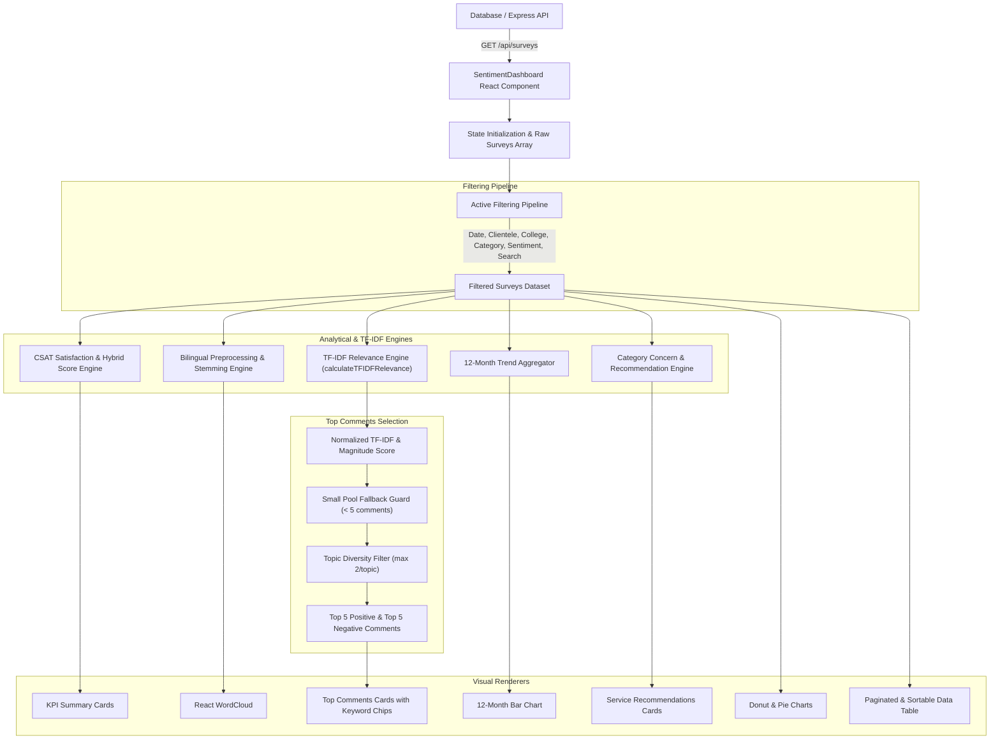

# Sentiment Analysis Dashboard — System Flow & Technical Guide

This document provides a comprehensive technical overview of the **Sentiment Analysis Dashboard** (`SentimentDashboard.js`) in the Henry Luce III Library Management & CSAT System.

---

## 📐 High-Level Architecture & Data Flow

---

## 🔄 Step-by-Step Page Operational Flow

### 1. Authentication & Security Layer
* **Modal Trigger**: Upon rendering, the dashboard checks `localStorage` for `loggedInUser`.
* **Access Barrier**: If unauthenticated, a login modal overlays the dashboard requiring credentials (`admin` / `admin`).
* **Session Persistence**: Successful login stores `loggedInUser` in `localStorage`, unlocking dashboard controls.

---

### 2. Data Retrieval & State Pipeline
1. **API Call**: On initial load (and date preset changes), `fetchSurveys()` issues an HTTP GET request to `http://localhost:5000/api/surveys` with `startDate` and `endDate` query parameters.
2. **State Updates**:
   * `surveys`: Holds all raw response records from the database.
   * `page`: Resets to `0`.
   * `selectedRowIds`: Resets to `[]` for batch actions.

---

### 3. Dynamic Multi-Parametric Filter Pipeline
The `filtered` array applies active user filters sequentially:
* **Date Presets**: `Today`, `This Week`, `This Month`, `All Time`.
* **Date Range**: Custom `Start Date` and `End Date` selectors.
* **Clientele Filter**: Student, Faculty, Staff, Researcher, CPU Admin, Alumnus/Alumni.
* **College Filter**: CARES, CAS, CBA, CCS, COED, COE, CHM, COL, CMLS, COM, CON, COP, COT, SGS, SHS, JHS, ELEM, KINDER.
* **Sentiment Filter**: Positive, Neutral, Negative.
* **Category Filter**: Facilities, Staff, Collection, Other/Uncategorized.
* **Year Selector**: Filters 12-Month trend chart metrics by academic/calendar year.

---

## 🧮 Core Analytical & Scoring Calculations

### A. CSAT Satisfaction Average (1–5 Scale)
Maps 5-point survey response strings to numeric scores:
$$\text{Satisfaction Scale} = \{ \text{Very Satisfied}: 5, \text{Satisfied}: 4, \text{Neutral}: 3, \text{Dissatisfied}: 2, \text{Very Dissatisfied}: 1 \}$$
$$\text{Avg Satisfaction} = \frac{\sum_{i=1}^{10} \text{Scale}(Q_i)}{N_{\text{valid questions}}}$$

---

### B. Controlled Domain Lexicon Engine (`CONTROLLED_LEXICON`)
To eliminate noisy tokens and standardize keyword labels across patron comments, detection is restricted to a structured **Controlled Domain Lexicon**:
* **Facilities Topics**: `Comfort Room`, `Air Conditioning`, `Tables & Seating`, `Wi-Fi & Outlets`.
* **Staff Topics**: `Librarians & Assistants`, `Security Guards`, `Staff Attitude`.
* **Collection Topics**: `Books & References`, `Catalogue & OPAC`.

---

### C. Controlled Lexicon Scoring Engine (`scoreCommentsWithLexicon`)
Ranks written English comments by matching domain entities within sentiment pools:
1. **Synonym Matching**: Scans comments against canonical synonym lists (e.g. `'cr'`, `'restroom'`, `'toilet'` $\rightarrow$ `Comfort Room`; `'catalog'`, `'opac'` $\rightarrow$ `Catalogue & OPAC`).
2. **Pool-Wide Topic Frequency**: Counts how often each canonical topic appears across the sentiment pool.
3. **Topic Relevance Score**:
   $$\text{normalizedTopicScore} = \frac{\sum_{\text{topic} \in d} \text{poolCount}(\text{topic})}{\sqrt{\text{Count}(\text{unique matched topics in } d)}}$$
4. **Blended Score**: Combines topic relevance ($70\%$) with sentiment magnitude ($30\%$):
   $$\text{blendedScore} = (0.7 \times \text{normalizedTopicScore}) + (0.3 \times |\text{SurveyScore}| \times 10)$$

---

### D. Sorting, Tie-Breakers & Small Pool Guard
1. **Primary Sort**: Comments in `topPositive` and `topNegative` are sorted descending by `blendedScore`.
2. **Tie-Breaker**: Identical topic scores are broken using sentiment magnitude `Math.abs(getSurveyScore(comment))`.
3. **Small Pool Guard**: If a pool has $< 5$ comments (where IDF values become near-uniform), TF-IDF is bypassed and comments are sorted directly by $|\text{getSurveyScore}|$.

---

### E. Topic Diversity Filter (`selectDiverseTopComments`)
Ensures top 5 comment cards cover varied topics rather than repeating the same theme:
* Iterates over sorted comments.
* Limits selection to **at most 2 comments per top keyword**.
* Fills remaining slots if fewer than 5 unique topics exist.

---

### F. 12-Month Side-by-Side Trend Aggregator
* Groups filtered responses by calendar month (`Jan` – `Dec`) for the selected `filterYear`.
* Computes side-by-side counts for **Positive**, **Neutral**, and **Negative** sentiments, along with monthly average CSAT satisfaction.

---

### G. Service Improvement Recommendations Engine
1. Calculates negative sentiment percentage per category (`Facilities`, `Staff`, `Collection`).
2. Triggers severity thresholds:
   * **Moderate Severity**: Negative percentage $\ge 30\%$.
   * **High Severity**: Negative percentage $\ge 50\%$.
3. Extracts primary keywords from negative feedback and scores evidence comments using `calculateTFIDFRelevance`.

---

## 📊 Dashboard Visual Components

| Component | Description | Data Source |
| :--- | :--- | :--- |
| **KPI Summary Cards** | Total responses, Avg CSAT, Positive/Neutral/Negative totals | `filtered` statistics |
| **Top 5 Comments Cards** | Top positive and negative patron comments with keyword chips | `topPositive` / `topNegative` |
| **12-Month Trend Chart** | Side-by-side bar chart of monthly sentiment distribution | `monthly12MonthData` |
| **Sentiment Donut Chart** | Proportion of Positive, Neutral, and Negative responses | `chartData` |
| **Category Breakdown** | Proportion of feedback across Facilities, Staff, Collection | `categoryChartData` |
| **Recommendations** | Actionable advice based on negative sentiment spikes | `categoryStats` |
| **Interactive Word Cloud** | Visual representation of top 60 frequent terms | `wordCloudWords` |
| **Paginated Data Table** | Sortable table with individual/bulk deletion capabilities | `reviewRows` & `pageRows` |

---

## 📥 Export & Management Features

### 1. Excel Export (`handleExportExcel`)
Generates a formatted multi-sheet Excel file via the `XLSX` library containing:
* `Sentiment_Summary_KPIs`: High-level metrics.
* `Top_Positive_Comments`: Top 5 positive entries.
* `Top_Negative_Comments`: Top 5 negative entries.
* `Detailed_Review_Entries`: Full filtered dataset with CSAT scores and timestamps.

### 2. Print Report Generation
Hides interactive controls (`Header`, `TopBar`, buttons) via `@media print` CSS rules, producing a clean paper audit report.

### 3. Record Management & Deletion
* **Individual Delete**: Clicking the trash icon opens a confirmation modal and deletes `http://localhost:5000/api/surveys/:id`.
* **Bulk Delete**: Checkbox selection allows batch deletion of multiple records simultaneously.
